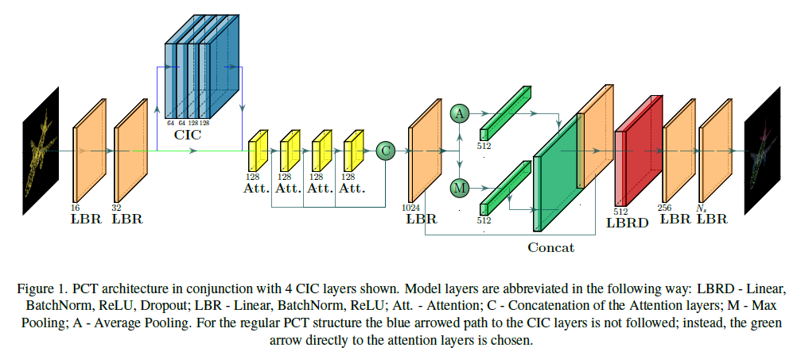
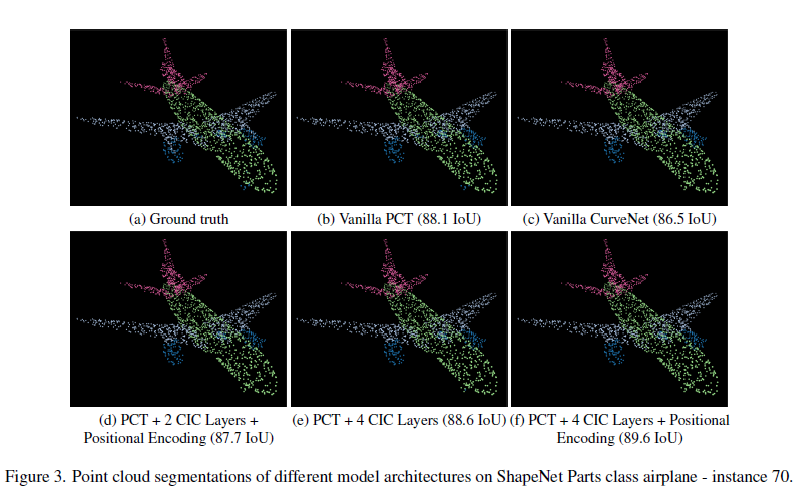

# Improving Point Cloud Shape Analysis of a Point Cloud Transformer using Curve Aggregation

PCT-CIC Paper: <a href="/docs/PCT-CIC_Paper.pdf" class="image fit"> Here </a>

PCT Paper: https://arxiv.org/pdf/2012.09688.pdf

CurveNet Paper: https://arxiv.org/abs/2105.01288


## Environment to Reproduce the Trainings

[YAML File](project_env.yaml)

## Abstract

<p align="justify"> Local feature aggregation is an operation that assembles point features of a given key point set, computes the position encodings of the subject point and the neighboring points, and passes the results into relevant transformation and aggregation modules in furtherance of local feature extraction. Even though these operations are feasible for depicting relative local patterns, they are inept with regard to long-range point relations. To that extent, the aggregation strategy introduced by Xiang et al. proposes a new long-range feature aggregation method, namely curve aggregation, for point clouds shape analysis. Initiative of our project is to implement the curve aggregation method upon the Point Cloud Transformer (PCT) of Guo et al., replacing the local neighbor embedding strategy. </p>

<p float="center">
  
</p>

<p align="justify"> After processing the point cloud into an input embedding using two subsequent Linear-BatchNorm-ReLU (LBR) layers, CIC blocks are introduced. Depending on the variation, two or fours layers of these blocks are included. Afterwards, the embedding which now contains not just local information but also global information from the curve grouping and aggregation is passed to the attention layers. In here each point learns to attend to relevant other points in four subsequent attention layers. After conducting both max pooling and average pooling to further aggregate global information, it is concatenated with the embedding from the attention layers to obtain a feature rich representation. Further processing is done in the Linear-BatchNorm-ReLU-Dropout (LBRD) and LBR layers until each point is classified as one of the part classes. </p>


## Dataset

<p align="justify"> In order to evaluate our proposed method, we used the ShapeNet Parts dataset for the task of part segmentation. Both PCT and CurveNet used this dataset as the basis for their model evaluation, enabling us to compare our results with theirs. The dataset contains 16,880 meshes categorized into 16 object classes (i.e. plane, car, chair) with 2-5 parts per object and a total of 50 part classes. As is common in other works, the class label is passed to the model during training and inference to facilitate the network to learn class-specific parts. In the inference setting, the class used for part segmentation can be predicted from the classification head. </p>


## Results

<p float="center">
  
</p>

<p align="justify"> Original PCT framework with the implementation of varying number of curve intervention convolution layers yields marginally higher performance. In particular, achieving 85.7 intersection over union metric compared to 85.4 of CurveNet architecture, demonstrating the effective use of curve grouping and aggregation methods of CurveNet upon PCT. The resultant hybrid PCT-CIC implementation thus verified to be an efficient candidate in the context of object part segmentation task. </p>


## Citation

<p align="justify"> Our project employs the existing networks and dataset provided below. Refer to the respective authors/repositories for further inspection. </p>

PCT:

```
@article{Guo_2021,
    title={PCT: Point cloud transformer},
    volume={7},
    ISSN={2096-0662},
    url={http://dx.doi.org/10.1007/s41095-021-0229-5},
    DOI={10.1007/s41095-021-0229-5},
    number={2},
    journal={Computational Visual Media},
    publisher={Springer Science and Business Media LLC},
    author={Guo, Meng-Hao and Cai, Jun-Xiong and Liu, Zheng-Ning and Mu, Tai-Jiang and Martin, Ralph R. and Hu, Shi-Min},
    year={2021},
    month={Apr},
    pages={187–199}
}
```

CurveNet:

```
@InProceedings{Xiang_2021_ICCV,
    author    = {Xiang, Tiange and Zhang, Chaoyi and Song, Yang and Yu, Jianhui and Cai, Weidong},
    title     = {Walk in the Cloud: Learning Curves for Point Clouds Shape Analysis},
    booktitle = {Proceedings of the IEEE/CVF International Conference on Computer Vision (ICCV)},
    month     = {October},
    year      = {2021},
    pages     = {915-924}
}
```

ShapeNet:
```
@InProceedings{ShapeNet,
    author = {Wu, Zhirong and Song, Shuran and Khosla, Aditya and Yu, Fisher and Zhang, Linguang and Tang, Xiaoou and Xiao, Jianxiong},
    year = {2015},
    month = {06},
    pages = {1912-1920},
    title = {3D ShapeNets: A deep representation for volumetric shapes},
    doi = {10.1109/CVPR.2015.7298801}
}
```
