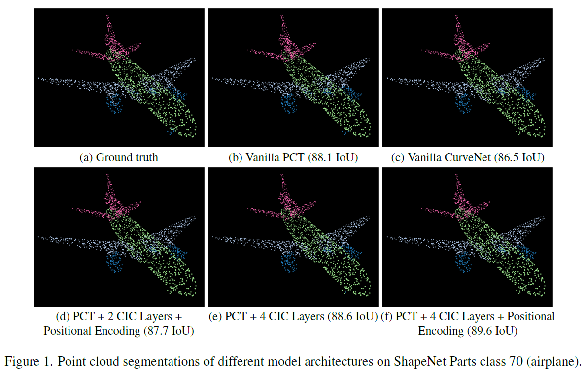

# Improving Point Cloud Shape Analysis of a Point Cloud Transformer using Curve Aggregation

This README will be updated soon, with required definitions and citations regarding the original PCT implementation by Meng-Hao et al.

Paper link: https://arxiv.org/pdf/2012.09688.pdf

Repository: https://github.com/MenghaoGuo/PCT


## <font color=red>News</font> :

* 2022.6.21 : Tasks carried out by date
* 2022.6.29 : ..

## Environment to reproduce the trainings

[yaml file](project_env.yaml)

## Astract


Local feature aggregation is an operation that assembles point features of a given key point set, computes the position encodings of the subject point and the neighboring points, and passes the results into relevant transformation and aggregation modules in furtherance of local feature extraction. Even though these operations are feasible for depicting relative local patterns, they are inept with regard to long-range point relations. To that extent, the aggregation strategy introduced by Xiang et al. proposes a new long-range feature aggregation method, namely curve aggregation, for point clouds shape analysis. Initiative of our project is to implement the curve aggregation method upon the Point Cloud Transformer (PCT) of Guo et al., replacing the local neighbor embedding strategy.

## Dataset


Apart from the baseline datasets that are used in PCT (which are ModelNet40 for point cloud classification, ShapeNet for object segmentation, and Stanford 3D Indoor Dataset), we will be exploring various other point cloud datasets (e.g. Partnet) to evaluate and verify our findings.

## Results


<p float="center">
  
</p>

## Citation  

CurveNet: 
```
@InProceedings{Xiang_2021_ICCV,
    author    = {Xiang, Tiange and Zhang, Chaoyi and Song, Yang and Yu, Jianhui and Cai, Weidong},
    title     = {Walk in the Cloud: Learning Curves for Point Clouds Shape Analysis},
    booktitle = {Proceedings of the IEEE/CVF International Conference on Computer Vision (ICCV)},
    month     = {October},
    year      = {2021},
    pages     = {915-924}
}
```

PCT:

```
@article{Guo_2021,
   title={PCT: Point cloud transformer},
   volume={7},
   ISSN={2096-0662},
   url={http://dx.doi.org/10.1007/s41095-021-0229-5},
   DOI={10.1007/s41095-021-0229-5},
   number={2},
   journal={Computational Visual Media},
   publisher={Springer Science and Business Media LLC},
   author={Guo, Meng-Hao and Cai, Jun-Xiong and Liu, Zheng-Ning and Mu, Tai-Jiang and Martin, Ralph R. and Hu, Shi-Min},
   year={2021},
   month={Apr},
   pages={187–199}
}
```
